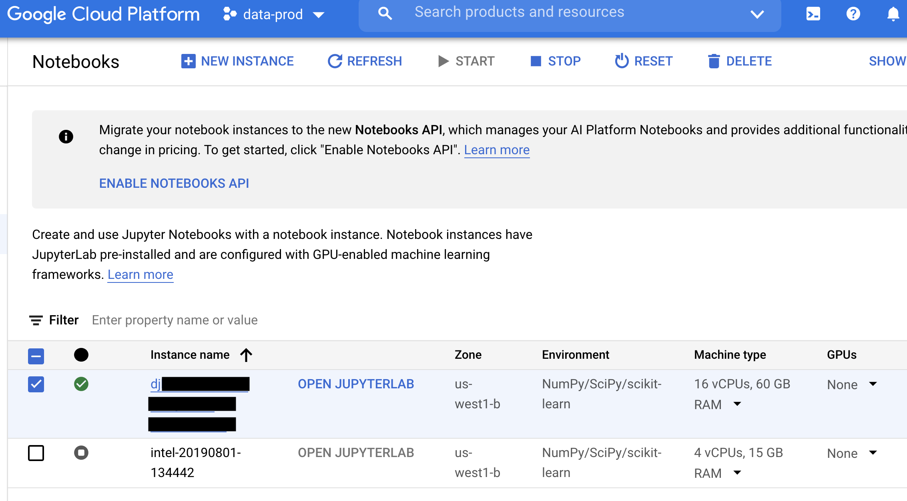
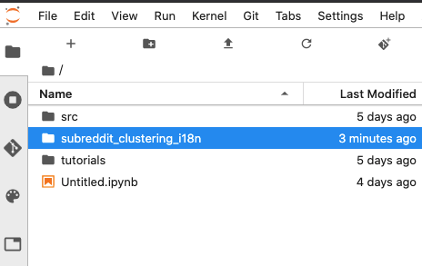
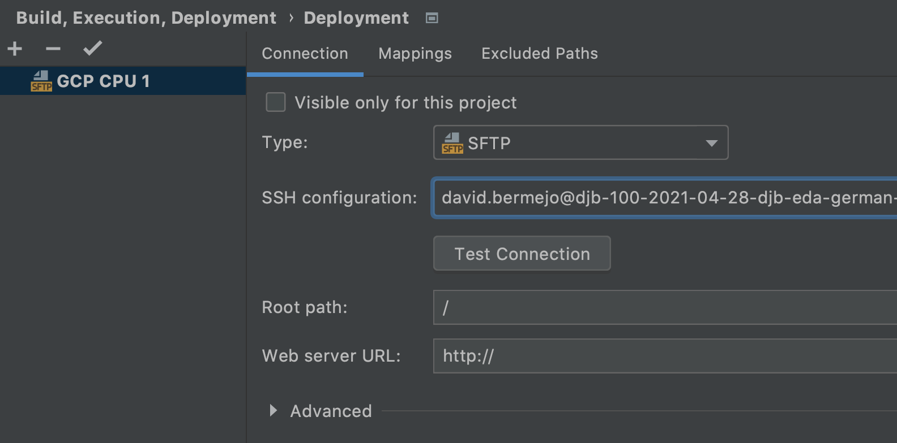
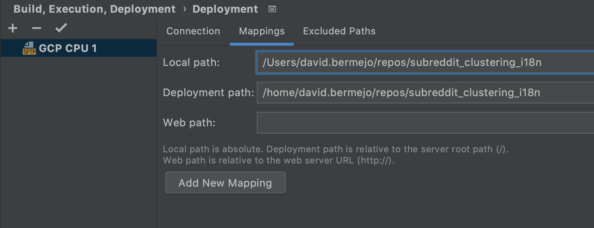
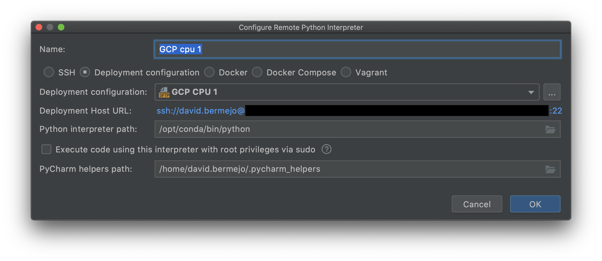

# GCP Notebooks + ssh setup

## URL Proxy for existing notebooks

#### Consoles:
VM instances in `data-prod` project:
- https://console.cloud.google.com/compute/instances?project=data-prod-165221

GCP AI notebooks in `data-science` project:
- https://console.cloud.google.com/ai-platform/notebooks/list/instances?project=data-science-prod-218515&lastRefresh=1633020573527

GCP spark clusters on `data-science` project:
- https://console.cloud.google.com/dataproc/clusters?region=us-central1&project=data-science-prod-218515


#### Individual VMs:
Inference for USE:
- Use for getting embeddings
- https://7958aa9a2f5e63c6-dot-us-west1.notebooks.googleusercontent.com/lab

CPU / EDA:
- Use for Dask cluster, bump to 64 CPUs & 400+ GB RAM)
- Use for regular EDA: (32 CPUs & ~64 GB RAM)
- https://1185e8680f9b40ca-dot-us-west1.notebooks.googleusercontent.com/lab?


## Create a GCP Notebook
For this project I'm using GCP notebooks for R&D because they offer self-service scalability & ssh connections that make it easy to integrate with PyCharm for local development & github integration.

For v0.1 we'll be using FastText and a CPU instance is good enough.
For v0.3 we need Tensorflow & GPUs to speed up inference.

Here's the dashboard to access GCP instances/notebooks:
- Prod: https://console.cloud.google.com/ai-platform/notebooks/list/instances?project=data-prod-165221
- Data-Science-Prod: https://console.cloud.google.com/ai-platform/notebooks/list/instances?project=data-science-prod-218515



You _could_  also list resources using the `gcloud` CLI tool (but we don't have permissions enabled to use it)
- https://cloud.google.com/sdk/gcloud/reference/notebooks/instances/list
```bash
gcloud notebooks instances list --location=us-west1 --project=data-science-prod
```

**TODO(djb)**: After v0 try a raw GCP machine instead. Suggested by Ugan:
- https://console.cloud.google.com/marketplace/product/nvidia-ngc-public/nvidia-gpu-cloud-pytorch-image?project=data-science-prod-218515

### Work-around (if you can't access the Notebook console)
If you can't access the AI Notebooks console, you can still stop, start, and resize **existing VMs** using the `VM instance` console:
- https://console.cloud.google.com/compute/instances?project=data-prod-165221

**To Start/Stop:**
- Click on the name of the VM  you want to update. It will take you to the `VM instance details` page.
- In the `VM instance details` page, you can click "Start/Stop" in the top row of buttons

**To Edit the VM**
If you want to change the CPU/RAM configuration:
- First go to the `VM details` page and stop the VM (see Start/Stop above). 
- Then, in the `VM instance details` page, click the `Edit` Button at the top left of the page.
- Once you're in the `Edit` page, you can change configurations and other details.

**To Get the URL for Jupyter Lab**
- First, go to the `VM details` page and start the instance (see above).
- Once the instance is running, search for the `proxy-url` field in the `Custom metadata` section. The value of that field should have the URL you can use to access Jupyter Lab.

Example:
- <UUID_generated_by_google>-dot-us-west1.notebooks.googleusercontent.com


### Set up gcloud tools in your laptop (if you haven't set it up)
In order to authenticate & connect to a GCP notebook, we need to use the `gcloud` SDK. For the latest instructions see here: https://cloud.google.com/sdk/docs/install
- Download the installer for your OS
  - Example: for intel Mac laptops (non M1) download `macOS 64-bit (x86_64)`
- Move & unzip the file in your home directory
- Run this command to install the sdk: `./google-cloud-sdk/install.sh`
- (Optional) Delete the zipped package

## Run authentication SDK & set default project name
After gcloud sdk is installed, run this command to create authentication tokens:
```bash
gcloud auth login
```

Set the default project with this command:
```bash
gcloud config set project data-prod-165221
```

### Set multiple configurations [optional]
If you have VMs in another project besides `data-prod-165221`, here's a guide to manage multiple gcloud configurations:
- https://www.the-swamp.info/blog/configuring-gcloud-multiple-projects/

The **tl;dr** is:
You can create a new config with this command:
```bash
gcloud config configurations create datascience-project
# Created [datascience-project].
# Activated [datascience-project].
```

Then you can see all your configurations with this command
```bash
gcloud config configurations list

# NAME                 IS_ACTIVE  ACCOUNT                   PROJECT                   COMPUTE_DEFAULT_ZONE  COMPUTE_DEFAULT_REGION
# datascience-project  True       david.bermejo@reddit.com  data-science-prod-218515
# default              False      david.bermejo@reddit.com  data-prod-165221
```

And to change your active configuration you use:
```bash
gcloud config configurations activate default
```

### Create SSH keys & refresh GCP tokens
```bash
gcloud compute config-ssh
# You should now be able to use ssh/scp with your instances.
# For example, try running:
#
#  $ ssh djb-100-2021-04-28-djb-eda-german-subs.us-west1-b.data-prod-165221
```

The default project is expected to be: `data-prod-165221`. If you want to connect to VMs in a different project you can use a `--project` flag. Or you might need to `activate` configuration (see above).
<br>`gcloud compute config-ssh --project=data-science-prod-218515`

This command will refresh authentication tokens & checks which virtual machines are available for you. You'll need to run it every ~8 or ~12 hours. [The documentation isn't clear on timing](https://cloud.google.com/sdk/gcloud/reference/compute/config-ssh).

The first time you run the command, it'll also create a new set of SSH keys. 
<br>**Note** that you'll be asked to create a passphrase for additional security.

### Connect to instance from command line
Once you have the keys & tokens refreshed, you can connect to your instance using regular ssh, like this:
<br>`ssh <notebook-name>.<notebook-region>.<project-name>`

For example:
<br>`ssh djb-100-2021-04-28-djb-eda-german-subs.us-west1-b.data-prod-165221`

#### Troubleshooting SSH failures
If the ssh command above fails, you may be able to use `gcloud` to connect with this command:

```bash
gcloud compute ssh --zone "us-west1-b" "djb-i18n-topic-modeling-python-cpu-20210804" --project "data-science-prod-218515"
```

TODO(djb) However, I haven't been able to use regular SSH (or PyCharm) to connect to the VMs in the `data-science-prod-218515` project... :sad-panda:
- https://cloud.google.com/compute/docs/instances/adding-removing-ssh-keys#instance-only

### What is home?
When you ssh, you will only have write access to your personal folder. When you ssh, your home will be:
<br>`/home/<gcp-user>`

In my case, it is:
<br>`/home/david.bermejo`

NOTE: When you are logged in via the JupyterLab GUI (HTTPS server), your home directory for JupyterLab will be:
<br>`/home/jupyter`


# Clone repo to JupyterLab. Use: create & edit notebooks
## Create new SSH key
Follow github's guide to create an SSH key & add it to your agent.
- https://docs.github.com/en/github/authenticating-to-github/generating-a-new-ssh-key-and-adding-it-to-the-ssh-agent

tl;dr:
0. Open a terminal
   
1. Generate new key with a passphrase
```
ssh-keygen -t ed25519 -C "your_email@example.com"

# if prompted for location, press enter to write to default
 Enter a file in which to save the key (/home/you/.ssh/id_ed25519): [Press enter]
 
> Enter passphrase (empty for no passphrase): [Type a passphrase]
> Enter same passphrase again: [Type passphrase again]
```

## Add SSH key to ssh-agent
After creating the key you'll need to 1) start the ssh-agent, 2) add your key to ssh-agent:
```
eval "$(ssh-agent -s)"

ssh-add ~/.ssh/id_ed25519
```

Note: you'll be prompted for your git passphrase.

## Add key to github
github's guide:
- https://docs.github.com/en/github/authenticating-to-github/connecting-to-github-with-ssh/adding-a-new-ssh-key-to-your-github-account

tl;dr:
shortcut for keys:
- https://github.snooguts.net/settings/keys
0. Go to reddit's enterprise github
1. Click on your user-name (top right corner) > settings
2. Click on `ssh and gpg keys`
3. Click on `New SSH key` button

On command line of your new VM:
4. Copy or open the public key for your new key. For example, open it in `nano` to copy it:
<br>```nano ~/.ssh/id_ed25519.pub```

5. Paste public key into the `Key` field in github
6. Add a `title` for the key. Example: `gcp TF machine` 


## Set default identity for git
If you try to pull & push, git might not know which identity to use, run these commands to set the global user/username anytime you do something with git (replace email & name with your own):
```
git config --global user.email "david.bermejo@reddit.com"
git config --global user.name "David Bermejo" 
```


## Clone repo to JupyterLab
The default method to clone uses HTTPS, but Reddit requires ssh authentication. So you need to open a terminal and clone it like so:<br>
`git clone git@github.snooguts.net:david-bermejo/subreddit_clustering_i18n.git`

After you clone, you can cd to the new folder with the repo & use git CLI as usual.

Note: it can be a bit confusing, but the version of the library we install won't be the same one that runs jupyter notebooks

Here's what the JupyterLab file explorer should look like after cloning the repo




# PyCharm Setup
## Add SSH connection to PyCharm
The notes below are a summary of Pycharm's detailed guides here:
<br>https://www.jetbrains.com/help/pycharm/create-ssh-configurations.html

- Open the Settings/Preferences dialog (`⌘,`)
- Go to **Tools > SSH Configurations**.
- Fill out the Host, User name, & other information to look like the screenshot below.
    - Host should be the same as what you use to connect via the command line, e.g., `djb-100-XXX-subs.us-west1-b.data-prod-165221`
- For **Authentication type** select `Key pair`
  - Note that `gcloud` will create the **Private key file** in: `~/.ssh/google_compute_engine`
  - Save the passphrase so that PyCharm can automatically upload without asking for it on each sync 


## Add deployment configuration (remote syncing)
After you've set an ssh connection, you can connect to the same host to sync changes between the two locations. You can find most of these options under the `deployment` menu:
<br>https://www.jetbrains.com/help/pycharm/creating-a-remote-server-configuration.html

- Settings ( `⌘` + `,`) > `Deployment` > Add (plus sign)
- When you use SSH, you should select the `SFTP` type.
- Set **Root path** to `/`
  - PyCharm uses relative paths later on that can be confusing
- For mappings, make sure to map local repo to remote repo location
  - Local path: `/Users/david.bermejo/repos/subreddit_clustering_i18n`
  - Deployment path: `/home/david.bermejo/repos/subreddit_clustering_i18n`
  - Deployment path 2: `/home/jupyter/subreddit_clustering_i18n` (this is where jupyter notebooks run)
- Exclude `/data` subfolder unless needed
  - Exclude path (data folder): `/Users/david.bermejo/repos/subreddit_clustering_i18n/data` 






### Upload & sync
The first time you create a deployment config, you might need to manually push all your local code to the new remote. One way to do it is to:
- `Right click` on the top-level (root) folder of your path
- \> `Deployment` > `Upload to <deployment>`


Other options: I prefer to sync only saved files, but you can change as you like.
- Go to: **`Tools` > `Deployment` > `Options`**


## Add remote interpreter to PyCharm
After you've set the remote connection you can use the remote interpreter. The notes below are a summary of Pycharm's detailed guides here:
<br>https://www.jetbrains.com/help/pycharm/configuring-remote-interpreters-via-ssh.html#ssh
- Settings ( `⌘` + `,`) > `Python Interpreter` > `Add...` (gear icon)
- Python interpreter path:
<br>`/opt/conda/bin/python`





# Install our module in `editable` mode
After you have the code for this project on your remote, you can install it as a module.

`Editable` mode makes it easy to continue editing your module and use the updated code **without having to re-install it**! This can speed up development when you pair it with jupyter's magic to automatically refresh edited code without having to re-install or re-import the package. For more info, check this [stack-overflow thread](https://stackoverflow.com/questions/35064426/when-would-the-e-editable-option-be-useful-with-pip-install)

To install the repo as a package as `--editable` in GCP, first assume sudo for your gcp user. Then install the code from where you stored the code synced to PyCharm.

In jupyter, you can add this magic at the beginning of a notebook to reload edited code:
In jupyter, you can add this magic at the beginning of a notebook to reload edited code:
```
%load_ext autoreload
%autoreload 2
```

If resolving packages is taking too long, might need to use a flag (in the short term):
- See https://stackoverflow.com/questions/65122957/resolving-new-pip-backtracking-runtime-issue<br>
`--use-deprecated=legacy-resolver`


```bash
sudo su - david.bermejo

# Install my additional libraries
pip install -e /home/david.bermejo/repos/subreddit_clustering_i18n/

# if resolving takes too long
pip install -e /home/david.bermejo/repos/subreddit_clustering_i18n/ --use-deprecated=legacy-resolver

# Each VM might have slightly different uses & requirements, so it's best
#  to install the specific VM's requirements using [extras]
pip install -e "/home/david.bermejo/repos/subreddit_clustering_i18n/[cpu_eda]"

pip install -e "/home/david.bermejo/repos/subreddit_clustering_i18n/[cpu_eda]" --use-deprecated=legacy-resolver

# install TF or Torch libraries
pip install -e "/home/david.bermejo/repos/subreddit_clustering_i18n/[tensorflow_232]" --use-deprecated=legacy-resolver

pip install -e "/home/david.bermejo/repos/subreddit_clustering_i18n/[tensorflow_233]" --use-deprecated=legacy-resolver


# VM in data-science project
pip install -e "/home/david.bermejo/repos/subreddit_clustering_i18n/[inference_4gpus_tf_234]" --use-deprecated=legacy-resolver


# ==
#  For some reason extras don't always work so it's sometimes easier to cd to folder
cd /home/david.bermejo/repos/subreddit_clustering_i18n
pip install -e ".[tensorflow232]" --use-deprecated=legacy-resolver

pip install -e ".[inference_4gpus_tf_234]" --use-deprecated=legacy-resolver
```

### `--user` in case installation doesn't work
Try `--user` install if above steps fail **(don't use `sudo su` in this case!)**.
For the tensorflow VM/image I tried the --user tag because I was getting access errors. & conflicts between library versions 
```bash
pip install -e "/home/david.bermejo/repos/subreddit_clustering_i18n/[tensorflow232]" --user --use-deprecated=legacy-resolver
```

If all else fails, install tensorflow-text directly:
```bash
pip install "tensorflow-text==2.3.0" --user
```

### Creating an `[extra]` set of package requirements
**NOTE** You may need to create an `extra` set of requirements if you're installing tensorflow libraries that conflict with the VM's baseline libraries. Usually these are:
- core libraries that pip might try to update
- Google-API pre-installed libraries that shouldn't be updated
- Tensorflow pre-installed libraries that shouldn't be updated

`setup.py` example:
```python
from setuptools import find_packages, setup

# install_requires gets installed ALWAYS
INSTALL_REQUIRES = [
  "mlflow == 1.16.0",
  "dask[complete] == 2021.6.0",
]

# extras only get installed when/if they're called explicitly
EXTRAS_REQUIRE = {
  "tensorflow_232": [
    "pyarrow == 4.0.1",
    "google-api-core == 1.30.0",
    "tensorflow == 2.3.2",
    "tensorflow-text == 2.3.0",
  ],
  
  "inference_4gpus_tf_234": [
    # core preinstalled, VM won't allow it to be over-written
    "pyarrow == 5.0.0",
    
    # GCP preinstalled
    "google-api-core == 1.31.2",
    
    # TF pre-installed
    "tensorflow == 2.3.4",

    # TF library needed to use USE-multilingual
    "tensorflow-text == 2.3.0",
  ],
}

setup(
    name='subclu',
    packages=find_packages(),
    version='0.4.0',
    description='A package to identify clusters of subreddits and/or posts',
    author='david.bermejo@reddit.com',
    license='',
    python_requires=">=3.7",
    install_requires=INSTALL_REQUIRES,

    # Additional groups of dependencies here (e.g. development dependencies).
    # Users will be able to install these using the "extras" syntax, for example:
    #   $ pip install sampleproject[dev]
    extras_require=EXTRAS_REQUIRE,
)
```


## Reference / weird conflicts & venv things
The base installation has some weird numpy conflicts so you may need to install as --user:

I tried creating a conda venv, but the venv for david.bermejo doesn't get shared for the `jupyter` user.

```bash
# find folder with conda/feedstock_root artifacts
# 2>/dev/null <- hides "permission denied" errors
find . -type d -name conda 2>/dev/null
```

First time set up of conda inside sudo users
```bash
sudo su - david.bermejo

# create copy of requirements from base requirements
#python -m pip freeze > base_requirements.txt
python -m pip list --format=freeze > base_requirements.txt

# append conda path
export PATH="/opt/conda/bin:$PATH"

# initialize conda
conda init bash

# close out of terminal & open again (for changes to go through)
exit

# create a copy of the base environment
conda create --name subclu_tf --clone base
```

```bash
# activate the new env
conda activate subclu_tf

# Install base libraries that maybe weren't part of conda
pip install -r base_requirements.txt --use-deprecated=legacy-resolver

```


# Running mlflow server on GCP

## Step 1: Run this command in the **GCP Notebok/VM**.
The new pattern is to call the mlflow DB for the current host name:
### Tensorflow Inference VM
```
mlflow server --backend-store-uri sqlite:///subreddit_clustering_i18n/mlflow_sync/djb-subclu-inference-tf-2-3-20210630/mlruns.db --default-artifact-root gs://i18n-subreddit-clustering/mlflow/mlruns 
```

### CPU-based VM with lots of RAM:
```
mlflow server --backend-store-uri sqlite:///subreddit_clustering_i18n/mlflow_sync/djb-100-2021-04-28-djb-eda-german-subs/mlruns.db --default-artifact-root gs://i18n-subreddit-clustering/mlflow/mlruns
```


## Step 2: SSH into VM from your local
I created a custom function to tunnel into your VM:
```bash
dj_ssh_mlflow cpu
```

Function definition
```bash
# ssh into gcloud boxes to see mlflow server locally
function dj_ssh_mlflow(){
	if [ $1 = "cpu" ];
	then
		remote_ip="XXXYYY.us-west1-b.data-prod-165221"
		local_port=5000

	elif [ $1 = "tf_inference" ];
	then
		remote_ip="XXXYYY.us-west1-b.data-prod-165221"
		local_port=5002

	remote_port=5000
	ssh -N -L $local_port\:localhost:$remote_port $remote_ip
}
```

### Step 3: Open GUI in a browser
Now you should be able to go to the browser and connect to your mlflow server. Replace the port as needed (e.g., `5000`, `50002` )

https://127.0.0.1:5002/


# Useful GCP consoles
### AI notebooks
https://console.cloud.google.com/ai-platform/notebooks/list/instances?project=data-science-prod-218515
> Create and use Jupyter Notebooks with a notebook instance. Notebook instances have JupyterLab pre-installed and are configured with GPU-enabled machine learning frameworks.

### VM Instances
https://console.cloud.google.com/compute/instances?project=data-prod-165221
> VM instances are highly configurable virtual machines for running workloads on Google infrastructure.

### **Machine Images**
https://console.cloud.google.com/compute/machineImages?project=data-prod-165221
> A machine image contains a VM’s properties, metadata, permissions, and data from all its attached disks. You can use a machine image to create, backup, or restore a VM

### **Data Proc clusters**
- https://console.cloud.google.com/dataproc/clusters?region=us-central1&project=data-science-prod-218515
- https://cloud.google.com/dataproc
> Dataproc is a fully managed and highly scalable service for running Apache Spark, Apache Flink, Presto, and 30+ open source tools and frameworks. Use Dataproc for data lake modernization, ETL, and secure data science, at planet scale, fully integrated with Google Cloud, at a fraction of the cost.

By default, these clusters will create a bucket where they'll store data and notebooks.
- Bucket created by a Data Proc cluster (`dataproc-staging-us-central1-212906482731-fh9nrzce`)
- [Example GCS data with cluster notebooks](https://console.cloud.google.com/storage/browser/dataproc-staging-us-central1-212906482731-fh9nrzce/notebooks/jupyter/cluster_notebooks;tab=objects?pageState=(%22StorageObjectListTable%22:(%22f%22:%22%255B%255D%22))&project=data-science-prod-218515&prefix=&forceOnObjectsSortingFiltering=false)


# Monitoring GPU usage
`htop` doesn't seem to have a way to monitor GPU stats, but here are some alternatives.

## JupterLab `Status Bar`
On the jupyter-lab UI, you can click on If you click on:
<br>`View` > `Show Status Bar`

At the bottom of your window you will see some icons on the bottom left-hand side. If you click on them, you can cycle through different stats, one of them will be `GPU` Stats. For example:
`GPU: Tesla T4 - 33.0%`

## Nvidia CLI tool - `nvidia-smi`
Nvidia's `nvidia-smi` is a CLI tool for GPU monitoring similar to `htop`. It's not dynamic like `htop` (which auto refreshes), but you can use some commands to refresh the data every N seconds.

```bash
nvidia-smi

Thu Jul 29 23:26:53 2021       
+-----------------------------------------------------------------------------+
| NVIDIA-SMI 460.73.01    Driver Version: 460.73.01    CUDA Version: 11.2     |
|-------------------------------+----------------------+----------------------+
| GPU  Name        Persistence-M| Bus-Id        Disp.A | Volatile Uncorr. ECC |
| Fan  Temp  Perf  Pwr:Usage/Cap|         Memory-Usage | GPU-Util  Compute M. |
|                               |                      |               MIG M. |
|===============================+======================+======================|
|   0  Tesla T4            Off  | 00000000:00:04.0 Off |                    0 |
| N/A   64C    P0    39W /  70W |  14378MiB / 15109MiB |     79%      Default |
|                               |                      |                  N/A |
+-------------------------------+----------------------+----------------------+
```

`watch` is my favorite command here because it auto-refreshes in a pseudo-dynamic way. After you're done (`Ctrl+C` or `:q`), you go back to your terminal without `stdout` clutter. The `-n` flag is followed by how often (in seconds) you want the call to `nvidia-smi` to happen.

For example, one of these:
```
watch -n 5 nvidia-smi
watch -n 4 nvidia-smi
watch -n 3 nvidia-smi
```


The NVIDIA CLI also has a flag to refresh, but it will print/stdout a brand new set of stats ever 10 seconds:

`nvidia-smi -l 10`

It's not great because, for example, after 1 minute (60 seconds), if you want to scroll back, you'll go through 6 stdout statements. 


# Debug connection
Sometimes the connection via the web will stop working (e.g., 524 errors). If jupyter itself is still working, you can restart the docker service that's in charge of the reverse proxy:

TODO(djb): add instructions to:
- ssh into machine
- check status of Jupyter server (first)
- check status of docker server (doesn't matter much... when in doubt restart)

For more troubleshooting tips:
https://cloud.google.com/notebooks/docs/troubleshooting#restart_the_docker_service

```shell
sudo service docker restart
```

# Debugging GPU Usage
TODO(djb)

**Warning** installing tensorflow-text without pinning existing dependencies can make GPUs unusable. So before installing anything, here's what a blank/raw GPU environment looks like:
      
```

```

# Setting up versioning for a bucket

Enabling Object Versioning can keep copies of a file if/when it is over-written.
This could be nice in case we over-write something by accident. More details:
- https://cloud.google.com/storage/docs/using-object-versioning#gsutil

## Turning on Object Versioning
However, it's good to limit how many copies we keep to prevent high costs if we store multiple versions of large files.

We can't check the status in the GUI/console, so we have to use `gsutil`. First, we can check the versioning status:

```bash
gsutil versioning get gs://i18n-subreddit-clustering
# gs://i18n-subreddit-clustering: Suspended
```

Then, we can enable it with `set on` or disable with `set off`:
```bash
gsutil versioning set on gs://i18n-subreddit-clustering
# Enabling versioning for gs://i18n-subreddit-clustering/...
```

If we check again, we see that it's now enabled:
```bash
gsutil versioning get gs://i18n-subreddit-clustering
# gs://i18n-subreddit-clustering: Enabled
```

## Setting up Object Lifecycle Policy
- https://cloud.google.com/storage/docs/lifecycle
- https://console.cloud.google.com/storage/browser/i18n-subreddit-clustering;tab=lifecycle?project=data-science-prod-218515


## Viewing/ working with older file versions
- https://cloud.google.com/storage/docs/using-versioned-objects#list-gsutil

You can view the retention in the console:
- Click on bucket to see bucket details
- Then click on the "LIFECCLE" tab at the top

You can also view it in gsutil:
```bash
gsutil lifecycle get gs://i18n-subreddit-clustering
# {"rule": 
#  [
#     {"action": {"type": "Delete"}, "condition": {"numNewerVersions": 3}}
#  ]
# }
```
